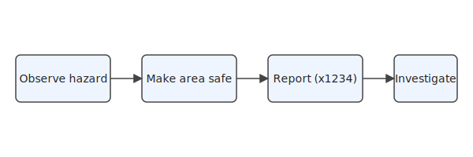

# Safety Rules

Safety is everyone's responsibility. The following rules apply to all personnel. The general rules are listed in {{tbl:rules}}, and the incident reporting flow is shown in {{fig:incident}}.

## General Rules

**{{table:rules | General safety rules}}**

| Rule | Applies To | Details |
|------|-----------|---------|
| Wear PPE in marked areas | Everyone | Hard hat, safety glasses, steel-toe boots |
| Report incidents immediately | Everyone | Use the online incident form or call x1234 |
| Complete safety induction | Everyone | Before accessing any operational area |
| Attend monthly safety stand-down | Employees only | First Monday of each month | <!-- row-tag: employee-only -->

## Incident Reporting

All incidents and near-misses must be reported promptly so the safety team can investigate and prevent recurrence. Follow the steps shown in {{fig:incident}}.

**{{figure:incident | Incident reporting flow}}**

## Emergency Contacts

- **Fire / Medical:** Dial 911 or internal x9999
- **Safety Office:** safety@acme.com
