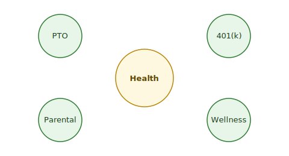

# Employee Benefits

The following benefits are available to permanent employees. {{fig:benefits-overview}} shows the benefit families at a glance, and {{tbl:benefits}} lists the details.

**{{figure:benefits-overview | Benefit families at a glance}}**

## Summary

**{{table:benefits | Benefits summary}}**

| Benefit | Details |
|---------|---------|
| Health Insurance | Medical, dental, and vision coverage from day one |
| Retirement Plan | 401(k) with 4% company match |
| Paid Time Off | 20 days per year, plus public holidays |
| Parental Leave | 12 weeks paid leave |

## Enrollment

- Benefits enrollment opens during your first week and during the annual open enrollment window in November.
- Visit the HR portal or contact {{support_contact}} for help.
