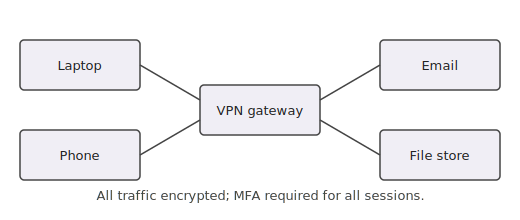

# IT & Security Policy

## Acceptable Use

- Company devices and network access are for business use.
- Personal use is permitted within reason but must not interfere with work.
- Do not install unauthorized software on company devices.

## Network Access

All remote access to company systems goes through the VPN gateway, as shown in {{fig:network}}. Multi-factor authentication is required for every session.

**{{figure:network | Remote access topology}}**

## Passwords

- Use a unique password of at least 12 characters.
- Enable multi-factor authentication on all company accounts.
- Never share your credentials with anyone.

## Data Handling

- **Confidential** documents must not be stored on personal devices. <!-- tags: [all] -->
- **Restricted** data requires encryption in transit and at rest. <!-- tags: [all] -->
- Contractors must return or destroy all company data at end of engagement. <!-- tags: [contractor] -->
- Employees must follow the data retention schedule in the HR portal. <!-- tags: [employee] -->

## Support

For IT issues, contact **helpdesk@acme.com** or call x5555.
