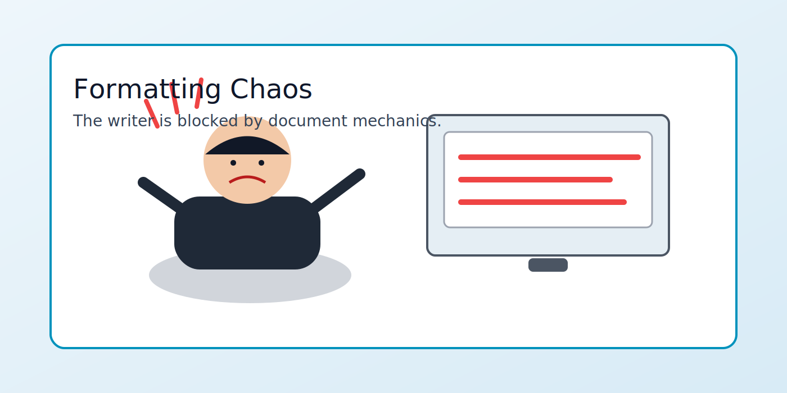
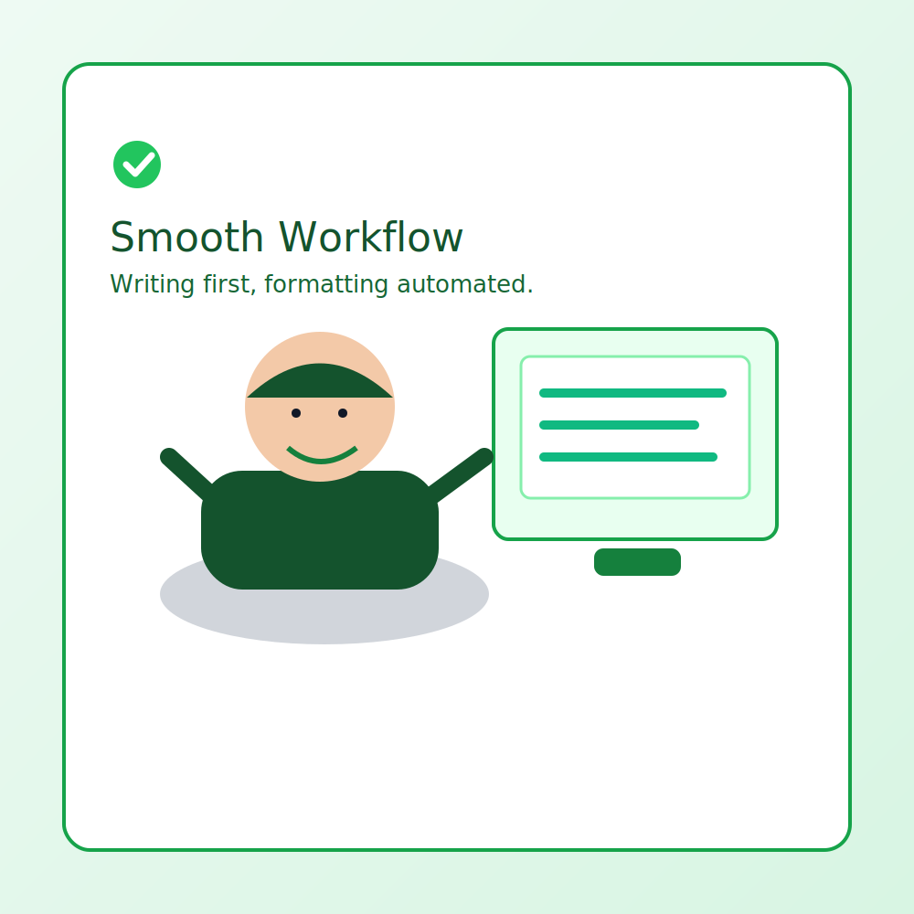
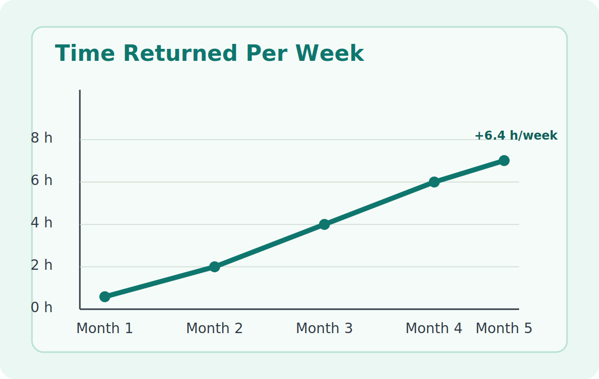

# The Three-Hour Advantage

### How Markdown Restores Writing Flow

---

## Monday Morning

On Monday, Daniel opened his weekly brief with the same hope: this one would be fast.

By afternoon, he was still fighting the file, not writing.

Word had restarted list numbering, shifted heading styles after a paste, and pushed an image to the wrong page. The table of contents still needed manual updates, and the file name had already become another "FINAL-final" version.

The writing took less than an hour. The formatting took more than three.

That evening, he told his colleague Maya, "I spend more time preparing documents than writing them." She answered, "Then stop preparing documents. Generate them."

She showed him a simple setup: config, chapter files, and one build command.

{.figure-full}
*{{figure:frustrated-cartoon | A common starting point: the writer is stuck in formatting friction instead of writing flow.}}*
{:.figure-caption .figure-full-caption}

## A Better Tuesday

The next day, Daniel wrote directly in one Markdown chapter.

No template hunting. No style cleanup. No hidden formatting surprises.

He focused on structure and message, then ran one command to generate a polished PDF.

The result looked consistent and publication-ready. Total time: a little over an hour.

He did not write less. He wrote with less friction.

## Why It Worked

The improvement came from removing overhead, not rushing.

First, content and presentation were separated. Daniel wrote words; the pipeline applied style.

Second, publishing became repeatable. The team stopped reinventing export steps every week.

Third, quality became scalable. Update style rules once, and future documents inherit the change.

Within two weeks, the team saw clear gains:

- Draft prep time dropped by about 60 percent.
- Formatting defects became rare.
- Reviews shifted from layout problems to content quality.

## Confidence, Then Adoption

{.figure-right}
*{{figure:happy-cartoon | Later state: confident output and a calmer writing process after adopting the generator.}}*
{:.figure-caption .figure-right-caption}

The biggest change was confidence.

Before, Daniel expected formatting surprises. After adopting the generator, he trusted the output and focused on clarity.

His manager noticed quickly: reports were cleaner and easier to read.

By month end, two more teammates joined the workflow. Onboarding was simple:

- Write in Markdown chapters.
- Keep sections modular.
- Run the build command.

Soon the team had a steady cadence: write, review, publish, without formatting fire drills.

## Time Returned

Three months later, Daniel had hours back each week.

{.figure-left}
*{{figure:time-returned-graph | Weekly hours returned after adopting the generator rose steadily over three months.}}*
{:.figure-caption .figure-left-caption}

He used that time to interview stakeholders, sharpen arguments, and mentor a junior analyst.

That is the practical value of this document generator: it moves effort from mechanics to thinking.

If your workflow feels heavy, start small. Write one chapter in Markdown, run one build command, and let the pipeline handle the rest.

## Version History

| Version | Date | Summary |
|---------|------|---------|
| 0.1 | 2026-06-10 | Initial narrative draft created. |
| 0.2 | 2026-06-10 | Story condensed to roughly one-third length. |
| 0.3 | 2026-06-10 | Added HMH logo support on cover and headers. |
| 0.4 | 2026-06-10 | Removed section illustrations from chapter content. |
| 1.0 | 2026-06-10 | Finalized example chapter for PDF generation demo. |
